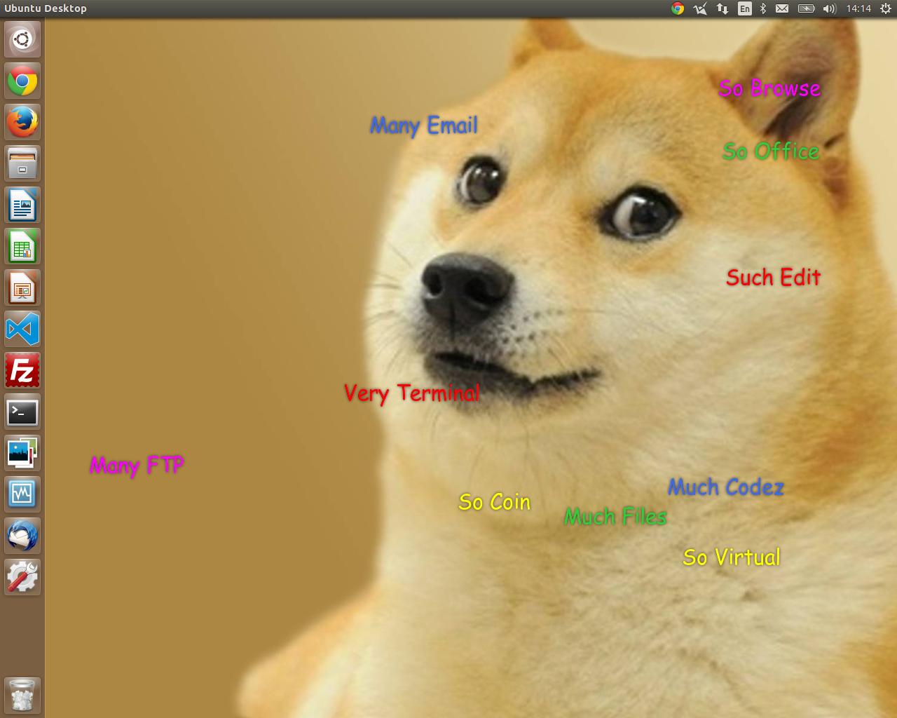

# Doge Desktop

An extremely wow desktop / app launcher, because Linux doesn't have enough doge.

*Doge Desktop running on Unity; it has been also tested with XFCE and Gnome, although should work with others...*

## Installation and Setup

To set up the desktop, simply clone this repository (making sure you have the python-webkit library installed) and set your computer to execute the *launch* script on logon. The interface runs on top of your usual desktop, so you can revert to it at any time by killing the process.

The dogeisms can be reconfigured at will to launch your favourite programs or to add extras by editing the configuration.json file - there is currently no graphical way of doing this. Please note that some launchers may not work initially if the preconfigured defaults are not installed on your computer. Wow.